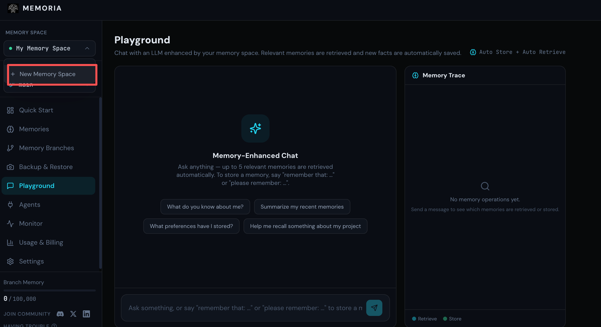
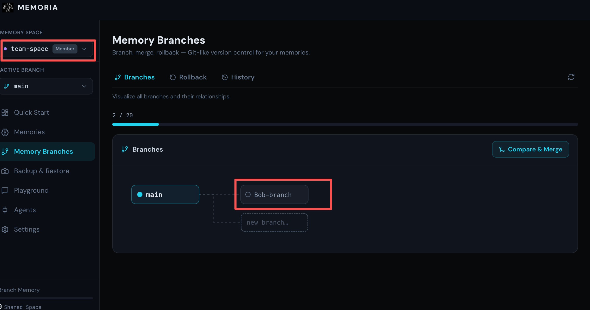
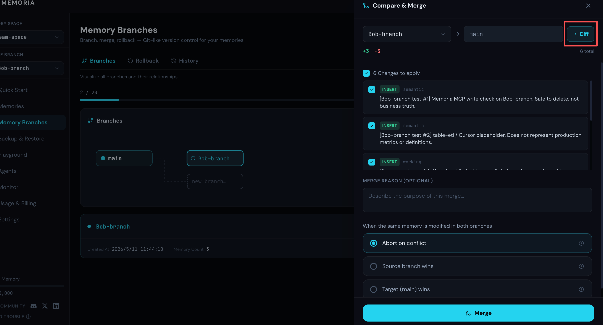

# Memoria 分支与空间协作正式上线：让团队的 Agent 记忆像代码一样协作

Memoria 的记忆分支与空间协作功能现已正式上线。

从现在开始，团队可以像协作代码一样协作 Agent 记忆：每个成员在自己的分支里沉淀经验，确认有价值后，再合并回团队共同维护的主分支。

空间协作是 Memoria 专业版能力之一，目前专业版限时免费开放体验。相比免费版，专业版提供更多记忆容量、分支、快照、记忆空间和检索次数，更适合团队持续沉淀和共享 Agent 记忆。

---

软件团队花了几十年，才把「代码协作」这件事做对。

早期的协作方式很直接：共享文件夹、邮件传代码，或者靠一句「你先别动这个文件，我在改」。后来有了版本控制，有了分支，有了 PR 流程。不是因为工程师喜欢把事情变复杂，而是因为多人维护同一个东西时，必须有机制管理改动、判断价值，并决定什么时候应该合进去。

现在，越来越多团队开始把 Agent 放进日常工作流。Agent 背后也有一套持续积累的记忆：项目约定、历史决策、踩过的坑、某个模块为什么不能那样改。这些内容不是一次性配置，而是团队知识的长期沉淀。

但过去，我们管理 Agent 记忆的方式，仍然更像早期的共享文件夹。

---

## 记忆孤岛让知识无法流动

一个在项目里待了一年的工程师，他的 Agent 里往往有很多真正有价值的上下文。不只是文档里能写清楚的接口说明，还有那些更细的判断：这个方案上次为什么没走通，那个模块有哪些历史包袱，某个需求背后的真实意图是什么。

这些内容很多时候不是正式文档，而是工程师和 Agent 长期配合后形成的工作记忆。问题在于，它只存在于一个人的空间里。

新人加入时，这套经验对他不可见。他的 Agent 只能从零开始，重新踩坑，重新积累。老人离开时，带走的也不只是个人经验，还有那套没有进入团队共同记忆的上下文。

这就是记忆孤岛的问题。每个人都在积累，但积累没有流动起来；每个 Agent 都在变聪明，但团队共同记忆没有因此变得更完整。

---

## 共识是需要被维护的

把记忆共享出来，是第一步。但共享不等于协作。

如果所有人都直接修改同一套记忆，新的问题很快会出现：哪些内容已经被验证，哪些只是临时想法，哪些是某个人正在测试的方案？当所有内容都混在一起时，团队很难判断这套记忆到底代表什么。

这和代码协作很像。主分支不应该是每个人随手提交的集合，而应该是团队当前认可的状态。Agent 记忆也是一样。它不仅要能被共享，还要能被维护。

真正重要的不是「有没有一份共同记忆」，而是「这份共同记忆是否值得被团队信任」。

---

## 分支是在保护共识

Memoria 的分支机制，就是为了解决这个问题。

每个人都可以从主分支拉出自己的工作分支。在自己的分支里补充上下文、整理经验、测试新的记忆组织方式，不会影响主分支，也不会打扰其他协作者。

当一段记忆被证明有价值，就可以提交合并，并写清楚合并理由。这一步很关键。它不是单纯把内容搬过去，而是在表达一个判断：这条记忆值得成为团队共同上下文的一部分。

换句话说，不是所有记忆都应该进入 `main`。只有被验证、可复用、可解释的记忆，才应该成为团队共同维护的主分支记忆。

主分支因此不再是所有实验过程的叠加，而是团队反复筛选后留下来的共识。它会持续增长，但不是无序堆积；它会越来越完整，也会保持可追踪、可回滚、可解释。

---

## 如何开始空间协作

实际使用时，整个流程可以概括为五步：创建协作空间、邀请成员、从 `main` 拉出分支、对比并合并、必要时从历史记录回滚。

你可以先在账号下创建一个协作空间。

然后切换到协作空间，复制邀请链接发送给协作者，把需要共同维护 Agent 记忆的人邀请进来。这个空间里的 `main` 分支，就是大家当前共同信任的记忆状态。

协作者加入空间后，可以从 `main` 拉出自己的工作分支。在这个分支里，他可以补充项目背景、整理经验，或者先测试一套新的记忆组织方式。这些改动只发生在自己的分支里，不会直接影响主分支。

当这部分记忆已经足够清晰，就可以点击 **Compare & Merge**，对比自己的分支和 `main` 的差异，并把有价值的内容合并回主分支。

合并之后，这段经验就会进入协作空间的共同记忆，供所有成员复用。

合并也不是不可逆的。如果后续发现某次合并不合适，可以通过 **History** 查看历史记录，找到需要恢复的记忆状态；需要回退时，再用 **Rollback** 回到那个更可靠的版本。

从创建协作空间到合并、回滚，所有操作都围绕同一套 `main` 记忆展开。协作者可以放心在自己的分支里整理和验证内容，只有确认有价值的部分，才会进入共同维护的主分支。

---

## 空间协作让团队记忆真正共享

分支解决的是「如何维护共识」，空间协作解决的是「谁可以一起维护」。

在协作空间里，所有协作者都可以围绕同一套主分支记忆工作。有人补充部署经验，有人整理模块背景，有人把最近踩过的坑合并进来。下一个遇到类似问题的人，不需要重新问一遍，也不需要等某个熟悉项目的人刚好在线，Agent 已经能从团队共同记忆里获得上下文。

更重要的是，这种积累是连续的。每一次有价值的合并，都会让团队记忆变得更可靠。参与协作的人越多、项目越久，这套共同维护的记忆和每个人各自积累相比，差距会越来越明显。

出了问题，也能回到历史记录里查看不同阶段的记忆状态。找到更可靠的版本，回滚，继续迭代。团队记忆不再是只能一路向前累积的黑箱，而是一套可以调整、可以恢复的协作资产。

软件团队花了几十年把代码协作做对。Agent 记忆的协作，不需要再从共享文件夹时代重新走一遍。

通过分支与空间协作，团队可以把个人经验沉淀为共同资产，让 Agent 记忆真正进入团队的长期积累。