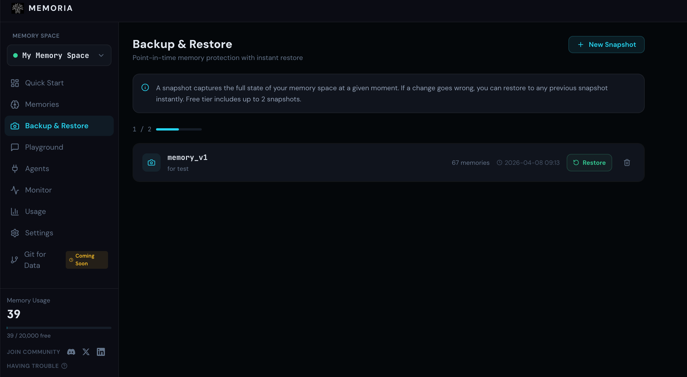
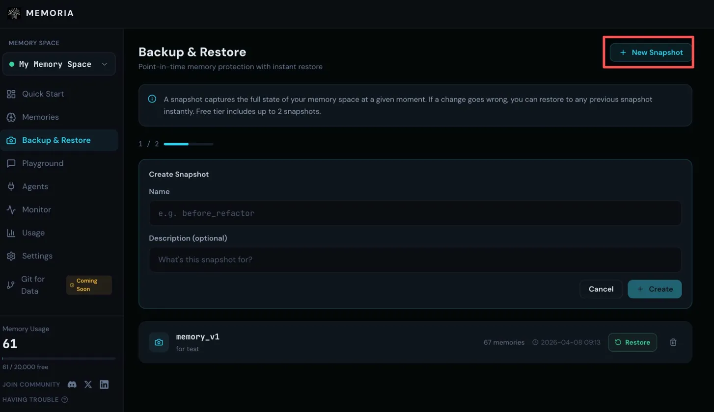
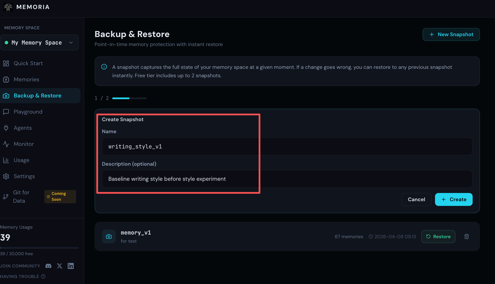
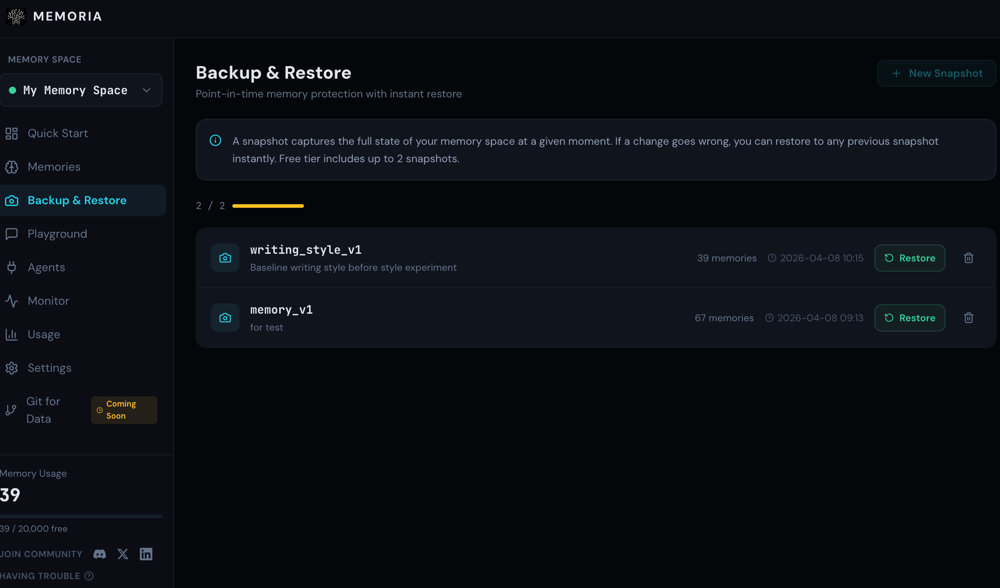
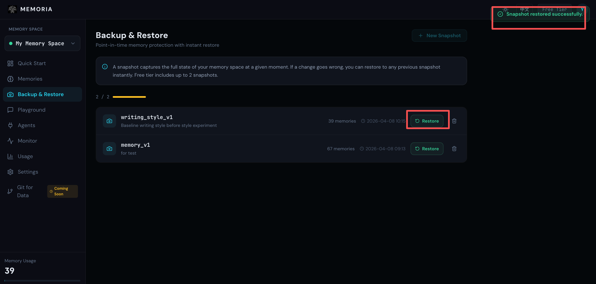

# Memoria's Backup & Restore Is Live: Your Agent Finally Has a Save Point

Memoria's Backup & Restore feature is now live. You can snapshot your agent's memory at any point in time and restore it instantly if something goes wrong. Free tier comes with two snapshots.

But before getting into how it works, it's worth talking about why we built it.

---

There's a kind of problem that's hard to catch in the moment.

Not a sudden breakage, but a gradual drift — a one-off task that pulled the conversation somewhere unusual, a prompt you were just testing, a session you barely remember. Your agent didn't do anything wrong. It just remembered everything that happened, the way it always does. The problem is that not every conversation is one you actually wanted it to learn from, and it has no way of knowing the difference.

The tricky part is that drift doesn't have a clear origin point. You can't point to a single conversation and say "that's where it went wrong" — it's usually the accumulation of many. By the time you notice something feels off, the version you worked so hard to build is already gone.

So you open the memory list. Hundreds of entries. You go through them one by one, trying to figure out which ones are the problem. Delete too much and you lose things that actually mattered. Delete too little and nothing changes. You're not really fixing it — you're guessing.

---

## Getting an Agent Right Takes More Than People Realize

The effort involved is easy to underestimate.

It's not just feeding it a few rules. It's the accumulated result of dozens of small corrections — the way it phrases things, how it interprets what you actually mean, the point where it starts finishing your thought before you've finished saying it. You're slowly transferring a piece of how you work into the agent. That's hard to put a number on, but you know what it cost you.

And then come the high-risk moments.

You want to try something new — a different workflow, a prompt strategy you're not sure about, an idea you want to explore. You know it might affect the memory. But there's no way to isolate the experiment. You either proceed carefully and hope the damage is minimal, or you don't try at all.

Or you finally get it exactly right. After a long stretch of "almost there," it clicks. The tone, the knowledge, the way it handles your specific kind of work — all of it lands. And then it keeps going, keeps learning, keeps drifting. That moment isn't saved anywhere.

The common thread in all of these isn't a malfunction. It's the absence of a fallback.

---

## A State Worth Keeping Should Be Kept

We're generally pretty good at protecting things that matter. Photos get backed up. Important files go to the cloud. We learned a long time ago that "it should still be there" isn't good enough for things we can't afford to lose.

Agent memory has been sitting in a strange blind spot. It runs, it grows, it accumulates — with no protection layer underneath. Backup & Restore is meant to fix that.

---

## Start Here

Say you have a writing agent you've spent a few weeks getting right: restrained tone, no exclamation marks, developer audience, paragraphs kept to three or four lines. One day you want to test whether it can write in a completely different style. Before you start, you save a snapshot.

**Step 1: Go to Backup & Restore and click New Snapshot in the top right**

**Step 2: Give the snapshot a name and describe what state it captures**

Done. You go ahead and experiment freely.

---

A few days later, the experiment is over. The agent has picked up the new style. Its memory now includes things like:

- *"Use exclamation marks to make the writing feel more energetic"*
- *"Question-based headlines perform better"*
- *"Tone can be more casual and relaxed"*

That's not what you want. You open Backup & Restore and find the snapshot.

**Step 3: The list shows all your snapshots with memory counts and timestamps**

**Step 4: Click Restore and confirm**

The memory is back to where it was before the experiment. The new style entries are gone. The agent is back to the version you built. The whole thing takes under a minute — no archaeology, no guesswork.

---

Knowing you can always come back changes how you work with your agent. Want to try something new? Try it. Want to test an idea you're not sure about? Test it. The downside is no longer "I broke something and I don't know how to fix it" — it's just "restore the snapshot and go again."

For agents you use and iterate on over a long period of time, this can become a basic part of the workflow. Snapshot at the key moments, and if something goes wrong you don't need to reconstruct everything from scratch — you just need to find the last state you trusted.

---

If you have an agent you've put real work into, now is a good time to save where it is.

You don't know what the next conversation will do. But you can make sure this moment is kept.