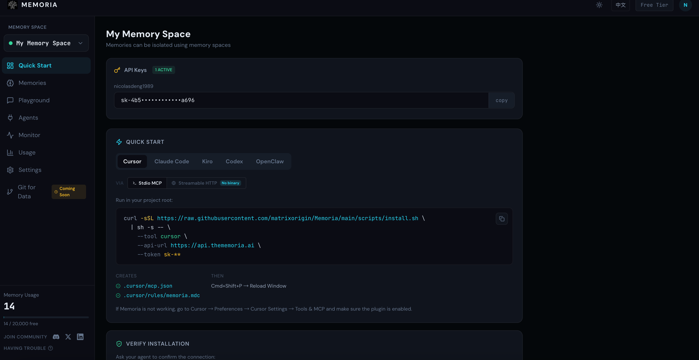
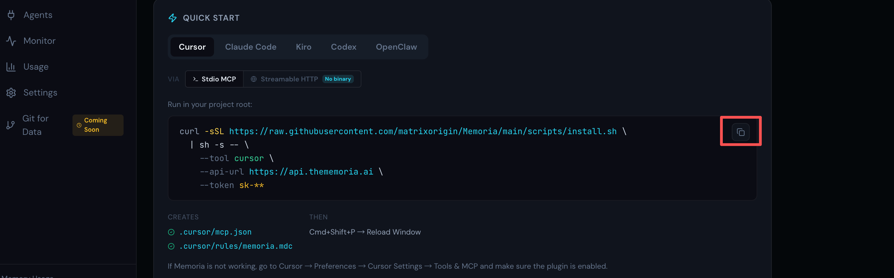
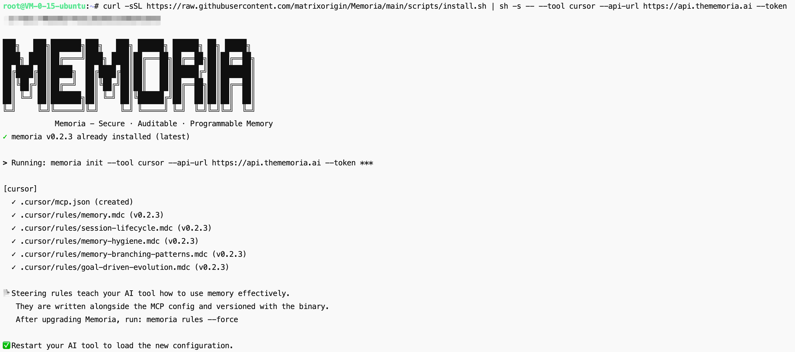
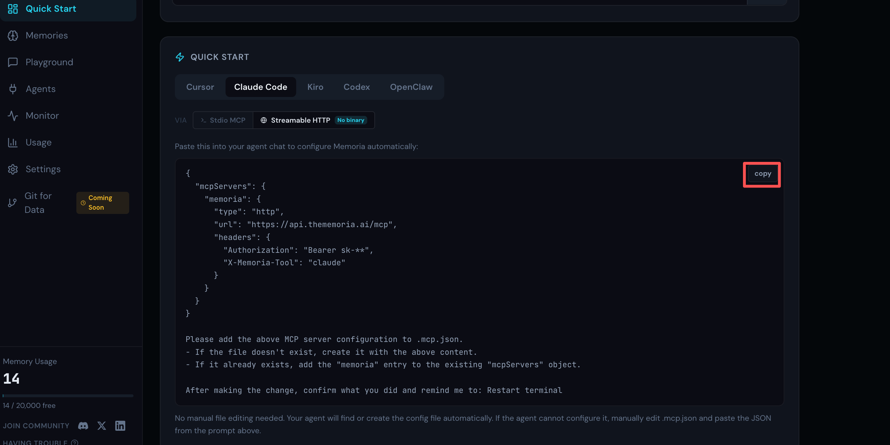
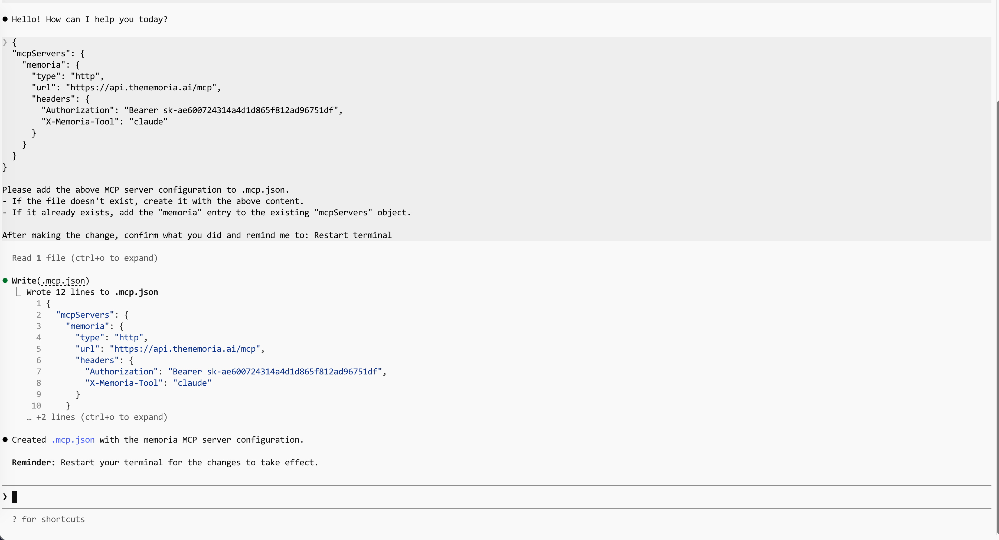
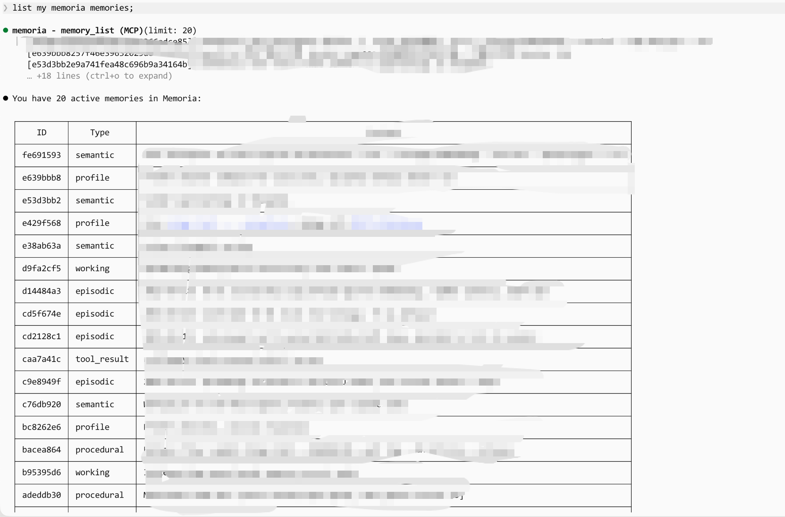

# Get Started in 1 Minute: Connect Your Coding Agent to Memoria

> One command. Persistent memory. Works with Cursor, Claude Code, Codex, and Kiro.

---

## Why You Need This

Coding agents are powerful — until they forget everything.

**Long tasks get interrupted.** A complex refactor spans multiple sessions. The agent crashes, the context window fills up, or you simply close the laptop. When you come back, the agent has no idea what it was doing, what's been tried, or what decisions were made. You start over.

**You use more than one agent.** Many developers switch between Cursor, Kiro, Claude Code, and others to compare coding quality. But every time you switch, you repeat the same context: project conventions, preferred libraries, architectural decisions. It's tedious and error-prone.

Memoria solves both problems. It gives every coding agent a shared, persistent memory layer — facts stored in one session are available in the next, across any agent.

**The whole setup takes under 1 minute.** Sign in, copy your key, paste one snippet — done.

---

## Step 1 — Get Your API Key and Install Scripts

Go to [thememoria.ai](https://thememoria.ai), sign in with one click (GitHub / Google), and copy your API key from the dashboard.

No database to set up, no backend to run.



---

## Step 2 — Connect Your Agent

Two ways to install: run a one-liner in terminal, or paste a config snippet into your agent chat (no binary needed).

### Option A: One-liner in terminal (Stdio MCP)

Copy the script for your agent and run in your project root, take Cursor as examle


**Cursor**

```bash
curl -sSL https://raw.githubusercontent.com/matrixorigin/Memoria/main/scripts/install.sh \
  | sh -s -- \
  --tool cursor \
  --api-url https://api.thememoria.ai \
  --token sk-xxxxx
```





After running, reload or restart your cdoing agent.

### Option B: Paste into your agent chat (Streamable HTTP, no binary)

Copy the JSON config from the Quick Start page on [thememoria.ai](https://thememoria.ai) and paste it directly into your agent's chat. The agent will write the config file for you. Take Claude Code as an example.


**Claude Code**




```
{
  "mcpServers": {
    "memoria": {
      "type": "http",
      "url": "https://api.thememoria.ai/mcp",
      "headers": {
        "Authorization": "Bearer sk-**",
        "X-Memoria-Tool": "claude"
      }
    }
  }
}

Please add the above MCP server configuration to .mcp.json.
- If the file doesn't exist, create it with the above content.
- If it already exists, add the "memoria" entry to the existing "mcpServers" object.

After making the change, confirm what you did and remind me to: Restart terminal
```



---

## Step 3 — Verify It Works

Ask your agent:

```
List my memoria memories
```

If Memoria MCP is connected, your agent will call the tool and return your memory count (may be empty on first use).

> 💡 **First time and seeing an empty list?** Head over to the [Memoria Playground](https://thememoria.ai/playground) first and store a few simple memories — like your name, your favorite language, or the project you're working on. Then come back here and ask your agent again. You'll see it recall what you stored, confirming the connection works end-to-end. 




---

## That's It

One command. Persistent memory. No more repeating yourself, no more lost context between sessions or agents.

Now go break a refactor across three sessions — your agent will remember where you left off.
