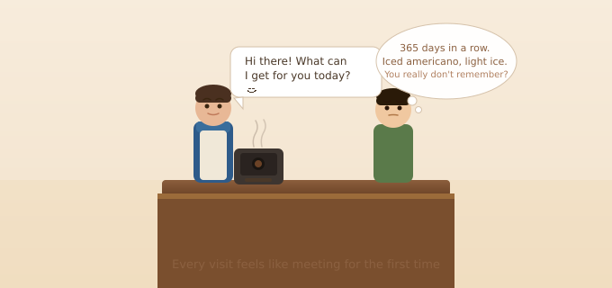
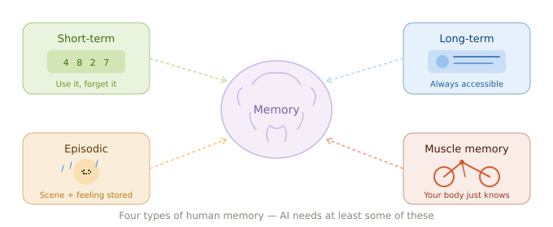
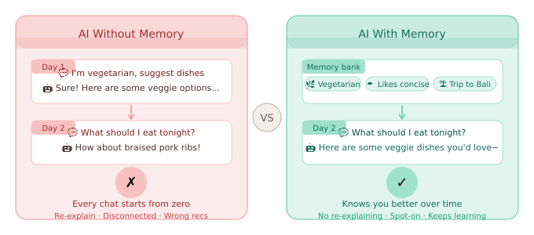
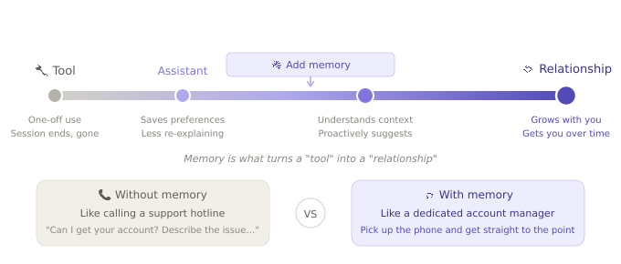

# Why Do AI Agents Need Memory?

Ever had this experience?

You go to the same coffee shop every single day. And every single day, the barista looks at you like you've never met. "Hi there! What can I get you?" Dude, I've been coming here for a year. Iced americano, light ice. Please.

That's basically what talking to most AI assistants feels like right now.

## Every Chat Feels Like a First Date. Exhausting, Right?

Open ChatGPT. Spend an hour planning your weekend trip. Close the tab. Come back the next day—

"Hi! How can I help you today?"

…Didn't we literally just talk about this yesterday?

You have to start over. Who you are, where you're going, what kind of hotels you like, that you're allergic to shellfish. The whole thing. From scratch.

It's like having a friend who gets their memory wiped every night. Your friendship is permanently stuck at "Nice to meet you."

Honestly, that's how we've been using AI for the past few years. It works, but something always feels… off. That missing piece? Memory.

## Your Brain Is Doing Way More Than You Think

We never really appreciate how much memory does for us, because it just works.

Walk into your regular noodle shop. The owner sees you and goes: "The usual?" You nod. Done. — He remembered your order.

Jump into a meeting with your team. Nobody starts with "So, what does our company do again?" — You all share context from last time.

You learned to ride a bike as a kid. Fell a few times, figured it out. Haven't ridden in ten years? You still know how. — Your body remembered for you.

- 🧠 Short-term — That verification code you just saw. Used it, forgot it. Totally normal.
- 🧠 Long-term — Your name, your address, your favorite movie. Filed away, always accessible.
- 🧠 Episodic — It rained on your birthday last year. You remember the scene, the feeling.
- 🧠 Muscle memory — Typing, biking, chopping vegetables. You do it without thinking.

AI doesn't need feelings. But it should at least remember the stuff that matters about you, right? Otherwise how does it ever get better at helping you?

## AI Without Memory: A Highlight Reel of Fails

See if any of these sound familiar:

🤦 **"I'm vegetarian" — and then it recommends steak**
Yesterday you told the AI you're vegetarian. It gave you amazing veggie recipes. Today you ask for dinner ideas. It enthusiastically suggests braised pork ribs.

🤦 **Your travel plan? What travel plan?**
You spent an hour nailing down your trip to Bali — flights, hotels, itinerary, the works. Next day: "Help me refine the itinerary." AI responds: "Where would you like to travel?"

🤦 **"Keep it short" — it writes you a novel**
You explicitly said "Be concise, skip the fluff." Next conversation, it hits you with a five-paragraph essay. As if that conversation never happened.

Every single one of these has the same root cause: the AI has no memory. Every conversation is a blank slate.

## Add Memory, and Everything Changes

The good news? The big AI products have started "growing a brain." And the difference is real.

### ChatGPT: No More Training a New Intern Every Day

In April 2025, OpenAI gave ChatGPT a major memory upgrade. It now remembers things from your past conversations and automatically applies them next time.

Told it you're lactose intolerant? Future recipes skip the dairy. Said you like tables? It defaults to table format.

It finally feels like going from "breaking in a new hire every morning" to "working with a teammate who actually knows you."

### Google Gemini: It Remembers What You Said AND What You Did

Google launched "Personal Context" for Gemini in 2025. It doesn't just remember your chats — it can pull from your Gmail, Google Photos, and other data to understand you better.

Ask it to "help me prep for next week's meeting," and it knows your schedule, remembers the open issue from last week's meeting, and even knows you prefer dark slide backgrounds.

Kind of like having an assistant who's been with you for three years.

### Claude: Memory You Can Actually See and Control

Anthropic's Claude added memory too, but took a different approach — full transparency. You can see exactly what it remembers. Edit anything. Delete anything. It organizes memories into neat categories: work role, current projects, personal preferences…

The biggest worry people have about AI memory is "what is it secretly remembering about me?" Claude's answer: here's everything, laid out in the open. You're in charge.

## It's Not Just Chatbots — Memory Is Changing All Kinds of Products

General assistants with memory? Cool. But the really interesting stuff is happening in specialized apps:

🏃 **AI Fitness Coach**
"You ran 3 more kilometers this week than last — nice work!" Instead of asking "What kind of exercise do you do?" every. single. time.

📚 **AI Study Buddy**
Remembers where you left off, which concepts you keep getting wrong, when your focus peaks. Knows your learning rhythm better than you do.

✈️ **AI Travel Planner**
Knows you love hidden gems, prefer Airbnbs over hotels, and hate packed schedules. Every plan builds on your taste, not a blank template.

💬 **AI Companions (Character.AI, Replika, etc.)**
Remembers your past conversations, your mood shifts, the names of people you've mentioned. Turns "chatting with a machine" into "talking with someone who gets you."

💰 **AI Budget Buddy**
"You spent $120 on bubble tea this month — that's 40% more than last month. Maybe ease up?" Ouch, but helpful.

## At the End of the Day, Memory Turns AI from a "Tool" into a "Relationship"

AI without memory? It's a tool. You use it, get a result, walk away. Every interaction is a one-off transaction.

AI with memory? That starts to feel like a relationship. It knows you. It gets better over time. You build up a shared history, a kind of shorthand.

Think of it this way:

- 📞 No memory = Calling customer support every time. "Can I get your account number? Can you describe the issue?" Start from zero.
- 🤝 With memory = You have a dedicated account manager who remembers everything. Pick up the phone and get straight to the point.

Which one would you rather deal with? Yeah, thought so.

## But Yeah, Memory Comes With Baggage Too

Nothing good comes without trade-offs. AI memory is no different:

🔒 **Privacy:** It remembers all this stuff about me — is that safe? What if it leaks? That's why every major product now lets you view, edit, and delete your memories.

🤔 **What if it remembers wrong?** AI logs the wrong preference, then keeps giving you bad advice based on it. Good memory systems need a way to correct mistakes.

🗑️ **Sometimes I want it to forget:** Just like in real life, there are things you'd rather not have brought up again. AI needs to support "selective forgetting" too.

The industry is taking these seriously. "User control over their own memories" is becoming a non-negotiable design principle.

## One Last Thing

Why do AI agents need memory? The answer is surprisingly simple —

Because that's how humans work.

You don't re-introduce yourself to your friends every day. You don't re-order from scratch at your regular spot. You don't start every meeting with "Hi, my name is…"

Memory is the foundation of relationships. The prerequisite for efficiency. The starting point for "it just gets me."

When AI has memory, it finally has a shot at becoming something more than a cold tool — a partner that actually gets better the more you use it.

## Oh, and One More Thing: Memoria

After all this talk about why AI memory matters, you might be wondering: so who's actually building this?

Here's an open-source project we're working on — [Memoria](https://github.com/matrixorigin/Memoria).

In a nutshell, Memoria is the persistent memory layer for AI agents. It's an MCP-based (Model Context Protocol) memory service that lets your AI assistant remember your preferences, facts, and decisions across conversations.

A few things that make it interesting:

🧬 **Git for memory** — This is Memoria's signature move. Every memory change is tracked with snapshots and an audit trail. You can create branches to experiment, roll back if things go sideways, and merge when you're happy. Just like developers use Git for code, Memoria lets you manage AI memory the same way.

🔍 **Semantic search** — Not just keyword matching. It retrieves memories by meaning. You said "I don't drink milk" once, and a future search for "dietary restrictions" will find it.

🛡️ **Self-governance** — Built-in contradiction detection and low-confidence memory quarantine. Your AI won't go haywire because it stored two conflicting facts.

🔒 **Privacy-first** — Supports local deployment and local embedding models. Your data can stay entirely on your machine.

Memoria currently works with Kiro, Cursor, Claude Code, Codex, OpenClaw, and any MCP-compatible agent.

Fun fact: the article you're reading right now was written in an AI environment running Memoria. It remembered my writing preferences, project context, and previous discussions — so I didn't have to re-explain everything from scratch.

Which is kind of the whole point, isn't it? AI with memory just hits different.

Curious? Check it out on [GitHub](https://github.com/matrixorigin/Memoria), drop a star, and try giving your AI a memory 🧠

> Experience the power of persistent memory for AI Agents. 🧠
> - 💻 GitHub (Star us!): [https://github.com/matrixorigin/Memoria](https://github.com/matrixorigin/Memoria)
> - 🌐 Website: [https://thememoria.ai/](https://thememoria.ai/)
> - 👾 Discord: [https://discord.com/invite/ahHAVVN6Gu](https://discord.com/invite/ahHAVVN6Gu)
